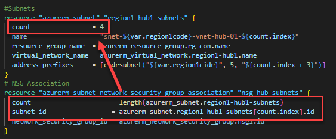

## Using Count and Length together

This example uses Count to create a number of Subnets, and then uses Length within an NSG Association Resource block to apply that NSG to all created Subnets:

Once you have created the primary resource (using Count), you can then use length(original_resource_name) to create other resources/associations/actions that will be carried out based on the value used within Count. This saves you from using a Count number or variable in multiple locations, so results in cleaner code. A Code example is here: [Count-and-Length.tf](Count-and-Length.tf)